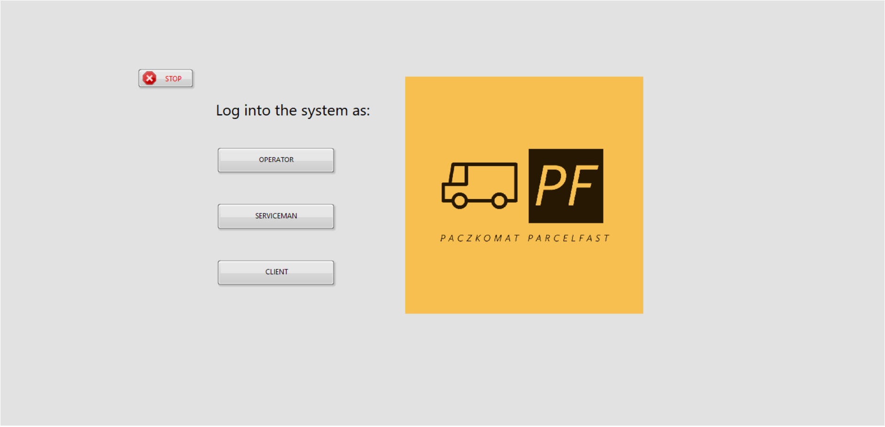
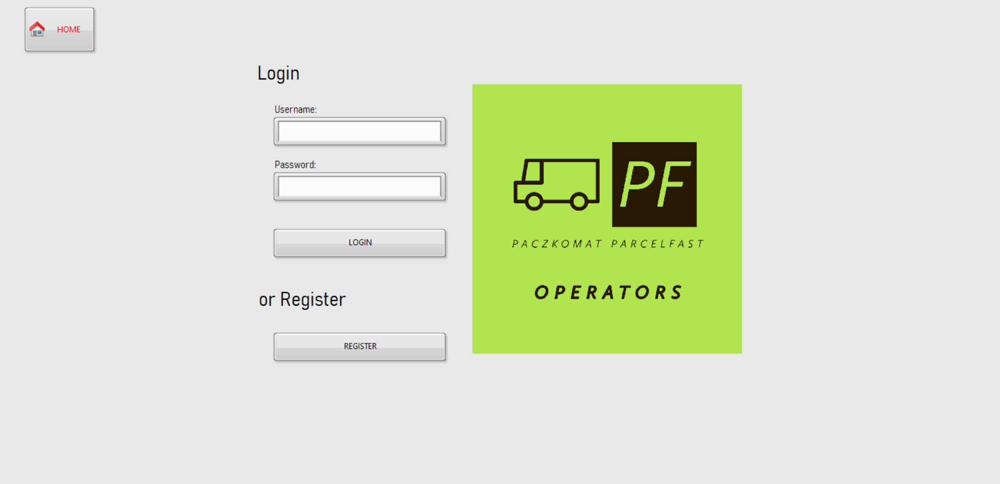
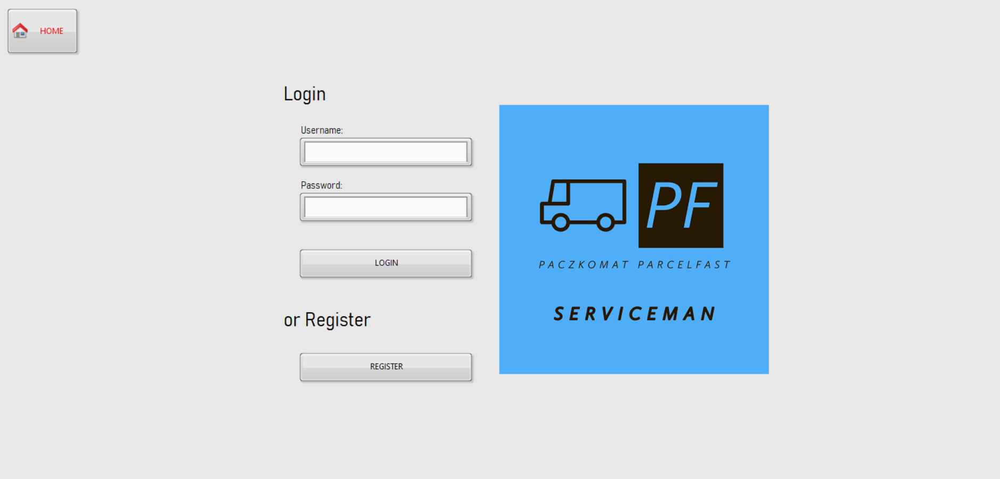
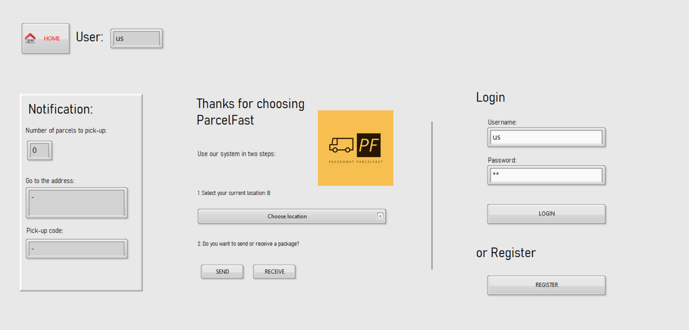

# parcel-locker-model
This is a project of a parcel-locker system. This project it is SCADA that was implemented in the LabVIEW environment.
The system allows three users to register and log in: the operator, the service technician and the customer(client). Everyone has a separate view. The system is close to the real-world, although it is not perfect.

In the project, various types of functionalities of this type of system were implemented. For example, alarms and events, sending and receiving parcels by the customer, monitoring data on filling the parcel locker, generating faults and overviews of the parcal-lockers, etc.

### Below you can see the main view of the system:

  

### Below you can see the operator view of the system:

  

### Below you can see the serviceman view of the system:

  

### Below you can see the view of the logged-in client to the system

  

